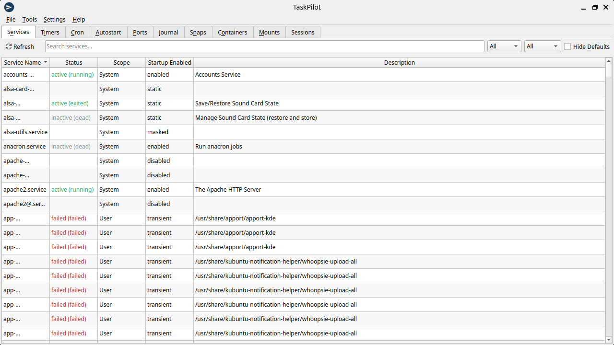
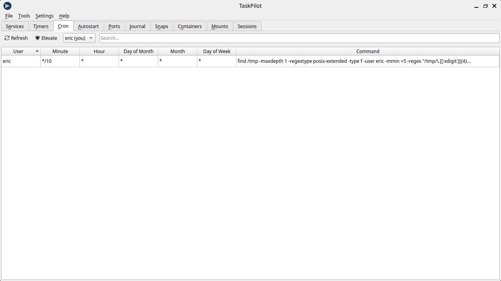

<!--
SPDX-FileCopyrightText: 2026 Eric Frost
SPDX-License-Identifier: GPL-3.0-or-later
-->

# TaskPilot

A system task manager for the KDE desktop. TaskPilot gives you one graphical
front-end for the many moving parts of a modern Linux system: **systemd
services and timers, mounts, cron jobs, autostart entries, listening ports, the
journal, snaps, containers and login sessions** — each in its own tab.

Built with Qt 6 and KDE Frameworks 6 (a C++ port of an earlier PyQt prototype).




## Features

- **Services / Timers** — start, stop, restart, enable, disable over systemd
  D-Bus (with a polkit prompt for system units); view logs, dependencies, the
  unit file and its environment. Scope, status and *Hide Defaults* filters.
- **Cron** — add, edit, delete and run cron jobs; view and edit other users'
  crontabs after authenticating.
- **Autostart** — create, edit, enable/disable and remove XDG autostart entries.
- **Ports** — listening sockets with the owning process; reveal root-owned
  sockets after authenticating; terminate or kill a process.
- **Mounts** — unmount, plus create/inspect bind links.
- **Containers** — Docker, Podman and Incus/LXD: start/stop/restart, logs,
  inspect, shell and remove (Docker visible without group membership via polkit).
- **Journal**, **Snaps**, **Sessions** views.
- **Tools** menu — create a new service or timer, a failed-units dashboard, and
  a boot-time (`systemd-analyze blame`) breakdown.

Privileged operations go through a KDE **KAuth** helper (polkit), so you are
prompted only when an action actually needs root.

## Building

Requires Qt 6.5+ and KDE Frameworks 6.

On Debian/Ubuntu:

```sh
sudo apt install cmake extra-cmake-modules g++ qt6-base-dev \
  libkf6coreaddons-dev libkf6i18n-dev libkf6xmlgui-dev libkf6config-dev \
  libkf6configwidgets-dev libkf6crash-dev libkf6auth-dev libkf6itemmodels-dev \
  libkf6itemviews-dev libkf6widgetsaddons-dev
```

Then:

```sh
cmake -B build
cmake --build build
sudo cmake --install build   # installs the binary, KAuth helper and polkit policy
```

Run with `taskpilot`.

## License

GPL-3.0-or-later. The project is [REUSE](https://reuse.software/)-compliant; see
the `LICENSES/` directory and the SPDX headers in each file.

## Author

Eric Frost

> Note: the AppStream component id is currently `org.kde.taskpilot` (provisional).
